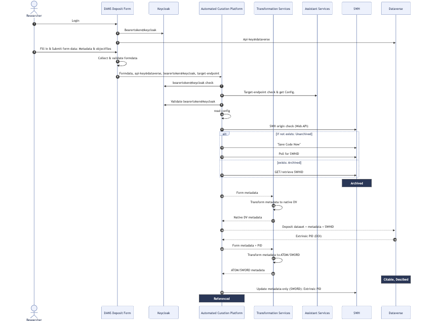
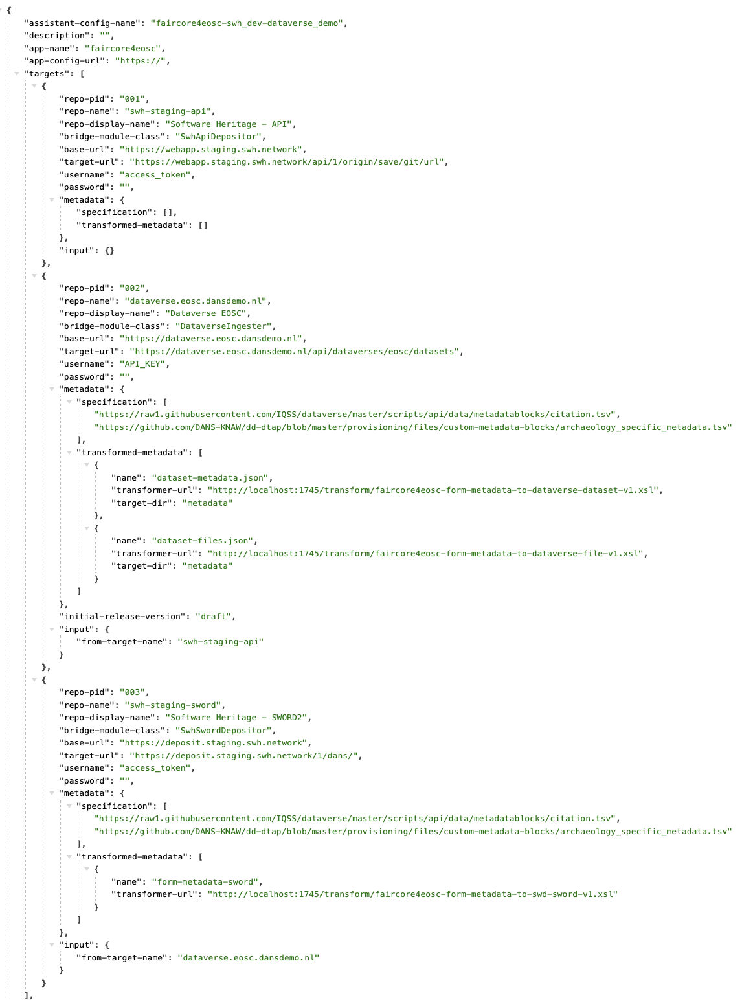

# Repository Assistant Service

## Overview

The Repository Assistant Service is a FastAPI-based application designed to manage and interact with various repository configurations. It provides endpoints for uploading, deleting, and retrieving repository configurations, as well as offering advice based on the repository metadata.

### Example use case: [Software Heritage (SWH) and Dataverse](https://swh.dansdemo.nl/)
- **Flow diagram**:  
- **Configuration**: 

### Table of Contents
1. [Prerequisites](#prerequisites)
2. [Dependencies](#dependencies)
3. [Configuration](#configuration)
4. [Authentication](#authentication)
5. [Endpoints](#endpoints)
6. [Middleware](#middleware)
7. [Startup Process](#startup-process)

---

## 1. Prerequisites <a name="prerequisites"></a>

- **Python**: Ensure that Python is installed on the system. The code is designed to work with Python 3.12 and above.
- **uv**: A Python package management tool that simplifies the process of managing dependencies and virtual environments. It ensures that all required packages are installed and up-to-date, making the development process smoother and more efficient. For more information, visit the [uv documentation](https://docs.astral.sh/uv/).

## 2. Dependencies <a name="dependencies"></a>

The following external libraries are required for the service:

- **FastAPI**: A modern, fast web framework for building APIs with Python.
- **Uvicorn**: An ASGI server for running FastAPI applications.
- **Starlette**: The underlying ASGI framework for FastAPI.

These dependencies can be installed using the following command:
### 2. Dependencies <a name="dependencies"></a>

The main dependencies include:

- **FastAPI**: A modern, fast web framework for building APIs.
- **Uvicorn**: An ASGI server for running FastAPI applications.
- **Starlette**: The ASGI framework supporting FastAPI.

### 3. Configuration <a name="configuration"></a>

Configuration settings are stored in the settings module. Ensure the following settings are appropriately configured:

- `FASTAPI_TITLE`: Title for the FastAPI service.
- `FASTAPI_DESCRIPTION`: Description for the FastAPI service.
- `SERVICE_NAME`: Name of the service.
- `DANS_REPO_ASSISTANT_SERVICE_API_KEY`: API key for authentication.
- `repositories_conf_dir`: Directory containing repository configuration files.

### 4. Authentication <a name="authentication"></a>

API key authentication is implemented using OAuth2 token authentication. The API key is specified in the api_keys list. To access protected routes, clients must include the API key in the request.

### 5. Endpoints <a name="endpoints"></a>

#### Public Endpoints

- **Routes**: Defined in the public.router module.
- **Tags**: "Public"
- **Prefix**: None

#### Protected Endpoints

- **Routes**: Defined in the protected.router module.
- **Tags**: "Protected"
- **Prefix**: None
- **Dependencies**: api_key_auth function enforces API key authentication.

### 6. Middleware <a name="middleware"></a>

The service includes CORS middleware (CORSMiddleware) to handle Cross-Origin Resource Sharing. It allows requests from any origin (allow_origins=["*"]) and supports various HTTP methods and headers.

### 7. Startup Process <a name="startup-process"></a>

The startup process involves the following steps:

1. **Initializing Repositories**: The service reads JSON files from the specified repositories_conf_dir during startup. Repository configurations are loaded using the installed_repos_configs function.
2. **Displaying Available Configurations**: The available repository configurations are printed to the console.
3. **Updating Service Information**: The service version is added to the data dictionary.
4. **Print Emoji Confirmation**: A thumbs-up emoji is printed to the console.

### 8. How to Run <a name="how-to-run"></a>

The service will be accessible at http://0.0.0.0:2810 and the API Docs will be accessible at http://0.0.0.0:2810/docs 
or  http://0.0.0.0:2810/redoc

To start the service, run the following command:
```bash

uv run src/main.py

```

The Repository Assistant Service will be accessible at http://0.0.0.0:2810 and the API Docs will be accessible at http://0.0.0.0:2810/docs 
or  http://0.0.0.0:2810/redoc